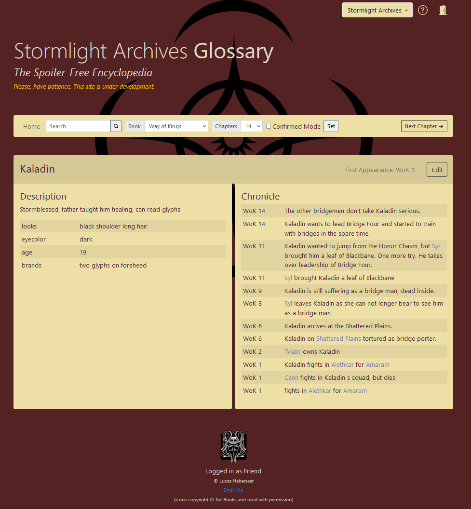

As a hardcore fantasy literature lover and enjoyer of especially thick books and series, I encountered the limitations of my brain‘s ability to keep track of all the characters. *Wheel of Time* being my favorite so far is an especially tricky one with 14 books. In such a series it is common for the authors to also add small hints and foreshadowing facts, that obviously mean something in the future. However, at the current chapter they are only mystery.

To enjoy such an endeavour in the best way, keeping track of all characters, facts, locations and other world-building elements, I had the idea to build a tool where these facts can be put in. Together with a timestep of the book location, I could even make it spoiler-free, only showing information up until the point one has set as his current one in the tool.

With this idea, my Spoiler-Free Glossary was born.

## Features

It is accessible on [glossary.lucashabersaat.ch](glossary.lucashabersaat.ch)
and has a glossary for *Wheel of Time*, which is empty, and *Stormlight Archives*, which I am filling while reading it. Currently, I‘m at book two, *Words of Radiance* of the four out there.

One can add entries, whether character, city, item, whatever. For each entry, information can be added with a tag. For example.
`looks: black hair, tall`.
However untagged is also possible to provide general info. Then, to each entry chronicles can be added. Chronicles being events that happened. Those have turned into be chapter summaries over time...
As it was cumbersome to link those to several entries, I made it detect automatically words that match existing entries and add links. Basically, you can just write a new chapter summary, and it makes the needed links by itself. When you visit a character, you see all the chapter summaries that mention it.
Each chronicle or fact is tied to a chapter and one can set the chapter one is currently at in the header. Then, all stuff further ahead in the books, the dangerous spoilers, are hidden away.

## Implementation
As I had, at the point of starting, only some experience with pure PHP, I implemented it without a framework in plain PHP. I wouldn‘t do it again like that, it has grown a little chaotic at places, but I like PHP and it is a small enough project to have it that way.
Some things are not done properly, some bugs are there and a lot of feature ideas lie ahead.

## Plan

At some point, I also want to make the project open-source such that everyone could set it up for himself. However, it is far from ready.

For now, it is fun to make and actually really useful. Something I programmed, useful, I am surprised by that the most.
