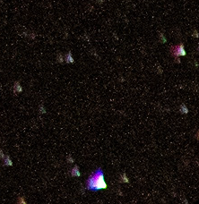

The universe and stuff, like many others, fascinates me and I've been observing it, learning about it and, ultimatively capturing it for a while now. I have a D-LSR and an amateur telescope and I have gone hunting the stars a few times so far. See image sections down below for the results. This post is more a **summary** of what I learned and experienced sofar, than it is a tutorial of any sorts. I am only an amateur that tries to learn this stuff.

## Preparations
A good preparation is half of the pie. To plan for a night observing the stars, time and location must be right. You want it to be as **dark**, as **clear** and as **cold** as possible to be able see the most with the eye as well as with the camera. Think also about targets you want to observe, there are tons of easy and difficult objects to search for. Tools like Google Maps, Google Earth, Dark Sky, Photo Pills and similar are great to find a good spot, timing and targets.
### Clear & Dark & Cold
The weather is a major party pooper, so a clear sky is a first requirement. Even though, some clouds may be interesting themes for photos.

Keep it dark by avoiding the moon and any artificial light source like the evil human cities to get rid of the major light polluters. So, pick a place away from civilization and during a new moon. Further, even though the sun is set, it takes some time until it is really dark, the later the better.

Heat is a problem, as it causes air turbulences which scatter light and make anything blurry. Avoid anything that is warmer than the cold night air itself, like concrete, houses and the like. High places are good and fields can also do the trick. Also, the less air between you and the target, the better for the same reason. Thus, shooting photos up straight is much less disturbed by air turbulences than nearer to the horizon.

Depending on your target, different times during the year are better. Visible star constellations change with the seasons and there are some astronomical events that are worth keeping an eye on, like the meteor shower of the Perseids in August.

The mountains are really good location in general. High, cold, dark and often remote. The SAC Huts in Switzerland are perfect hiking locations to admire the beauty of the night at remote locations where one can eat, stay overnight and hike on the next day.

### Targets
If you can see the milky way with the eye, that is already a great indicator for a good setting.
Inform yourself a bit beforehand about the night sky and what you can see. Recognizing something is really rewarding and training yourself to navigate through the endless seas of tiny lights helps you to track down specific targets.
Start easy, the moon, the milky way, maybe some star clusters like the Perseids. Don't begin with something difficult, that will only demotivate if not a success.

### Gear

Very briefly, the minimal stuff you should have for taking decent images of the night sky is a good D-LSR camera, a tripod and a good lens. A wideangle lens with f2.8 or lower would be optimal, but higher is fine aswell for first results. You find a list of my personal gear down below.

Well then, grab your stuff together, really warm clothing, some tea and snacks and go!

> tl;dr To get the most out of the night sky, look for locations that are dark & cold, and pick a time with clear weather and a new moon.

## Observing

The eyes also take some time, around 20 minutes, to adjust to the dark and see better. Red light instead of white for flashlights to not ruin the dark adaption.

One of my favorites targets so far is the Andromeda Galaxy. With the eye, it is slightly visible as a speck of light if you do not look at it directly. Finding it is not an easy, but very satisfying task. Using some star charts and by **hopping** from star to star, you can locate the Galaxy. With the camera capturing is easier, and I did that by accident, when the conditions are right.

## Taking Pictures

First of all, you want to take a lot of photos, make your trip worthwhile. Make sure you have the right gear, such that it is as comfortable and easy as possible to stay up outside as long as needed. I assume a bit of basic knowledge about camera settings and handling.

**Focus on Stars**:
Set up your camera onto the tripod and go into _Manual_ mode. Turn off _Auto Focus_ and use the _Live Mode_ (if you have one, hopefully) to zoom in on a star and focus on it manually. The goal is to make the star as small as possible.

**Settings**: You want to leave as much light in as possible, so set the aperture as low as possible and set ISO around 1600 - 4000. To estimate the exposure time, use the [500 Rule](https://wildromanticphotography.com/melbourne/tips-advice/what-is-the-500-rule-in-photography/), it will be around 5 to 25 seconds. However, every camera is different so this process is really a **trial and error** and really finding out what works best for you.

Well, now shoot, capture and take as many pictures as possible. If on the images not so many stars are visible, don't worry, in post-editing a lot can be pulled out.

## Post-Editing
To be honest, I am not very experienced yet with post-processing astro photographs and an expert has a lot more to say. That said, for me a lot is just trial and error and playing around again. Typically, first adjust the tone and temperature, then increase contrast, light and exposure. An important thing is to not overly adjust, it might be tempting but will definitely make the image look unnatural. It is a delight to see the stars come forth when just playing with one slider. They are hidden in very dark pixels and with the right settings can be brought about.
To edit I use the Adobe's applications _Photoshop_, _Bridge_ and _Camera Raw_ which really are worth their price and simplify a lot.

### Stacking
The camera has natural noise which is visible in particular in the black parts of the image (see image below) that makes the background not as black as in real life. One method to decrease noise is stacking. By stacking around 10 to 20 pictures taken at the identical setting and position, noise can be drossled down. I use _Sequator_ for Windows to stack, however I did it only once so far.

## My Gear
- Camera: Canon EOS 7D Mark II
- Lens: Canon EFS 18-135mm (f3.5)
- Telescope: Star Sense DX 130

I plan to upgrade and get myself a wideangle lens. Further, I am experimenting with putting the camera on the telescope, however this has not been successful yet.

## Some results

### 5.9.2019 - Terri Hut, Alps
Here, on the first one, the Andromeda Galaxy is visible on the right side.

### 7.9.2021 - Dingenhart, near my home
The Pleiads are prominent here on the bottom half. Clouds can be a stylistic theme.

### 8.10.2021 - Rugghubel Hut, Alps

### 23.10.2021 - Homburg, near my home, stacked
Far from perfect, artefacts can be seen in particular at the borders. I should use a cable shutter release to avoid moving the camera in between shots.

